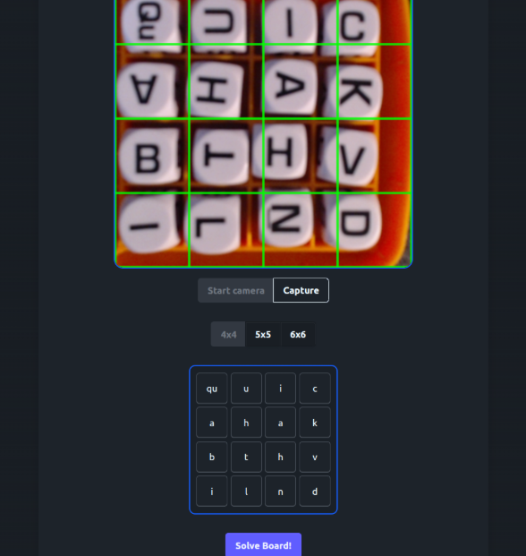
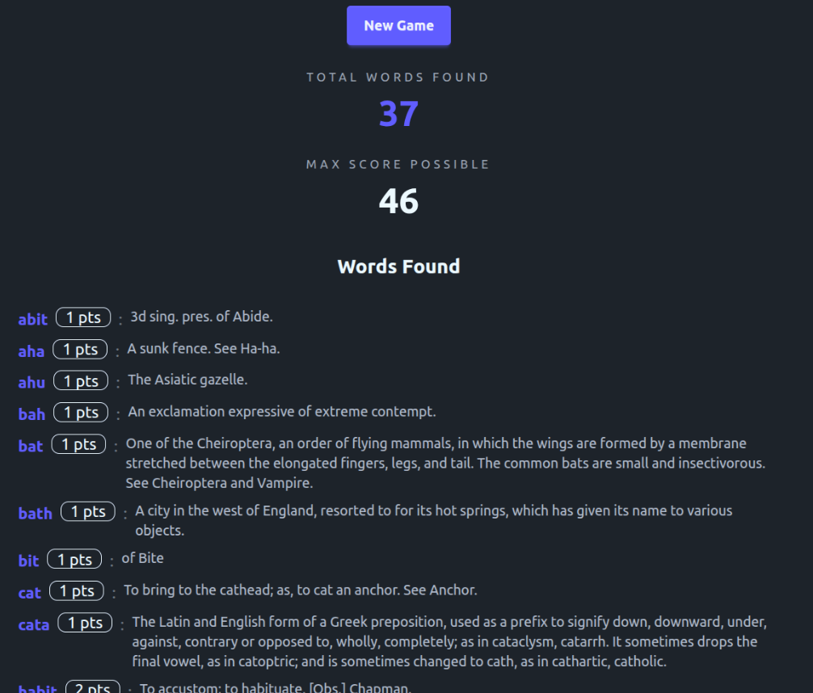

# Boggle Oracle

Boggle Oracle is a browser based Boggle solve that uses your device’s camera to capture a board, automatically recognizes each tile’s letter and then runs a solver to find valid dictionary words with their definitions. It does the letter recognition locally in the browser by splitting the captured image into a grid of tiles and classifying each tile with an ONNX model so there’s no serverside processing. Once the grid is filled, the board’s letters are parsed into WebAssembly which was compiled from C++ via the Emscripten em++ compiler. The letter model was trained using a labeled Boggle tile dataset from Roboflow.

You can test the app for yourself by visiting the below URL!
https://kenkot.github.io/BoggleOracle/

Simply select the desired board size (4x4, 5x5, 6x6) and click "Start Camera" to use the camera. Once you align the camera grid with the letters, click "Capture". If the some letters are off, or you wish to not use a camera you can manually enter letters in the grid, then click "Solve Board" to get the results!

